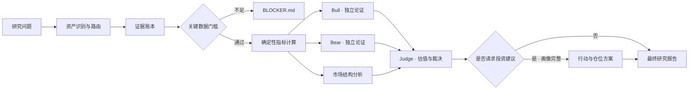

<div align="center">

# SAS‑FAS Analyst

### 面向美股与加密资产的证据优先型深度研究系统

[](https://github.com/BTspaceC/SAS-FAS-analyst/tree/main)
[](#安装与调用)
[](#研究边界)
[](#验证与质量控制)
[](LICENSE)

**真相先于立场 · 证据先于确信 · 生存先于仓位**

</div>

---

SAS‑FAS 是一套面向 AI Agent 的长期投资研究 Skill。它把监管文件、财务数据、链上状态、协议机制、市场结构与用户资料，整理为可追溯的证据账本，并在相互隔离的 Bull / Bear 论证之后，形成概率估值、风险判断与可执行裁决。

V5 将旧版多技能接力重构为**一个用户入口**。主编排器保持紧凑，只按资产类型与任务需要加载美股、加密资产、估值、市场结构及仓位决策模块，因此单入口不会等于把所有上下文一次性塞入模型。

> 默认研究期限：**3–5 年为主，1–2 年为辅**。SAS‑FAS 不负责预测未来几个月的价格波动。

## 核心原则

- **证据账本**：每一项重要事实都必须对应来源、截止日期、证据等级与置信度。
- **对抗独立**：Bull 与 Bear 使用同一份已验证资料，但彼此隔离，避免结论污染。
- **资产路由**：银行不套用制造业模板，Token 不被当作公司股权，混合资产拆分研究。
- **确定性计算**：财务与 Token 指标交给 Python 计算，避免模型心算与口径漂移。
- **数据不足即停止**：关键缺口可能改变裁决时，生成 `BLOCKER.md`，不以叙事填空。
- **长期赔率纪律**：观点可以激进；仓位必须能承受永久损失、流动性冲击与归零风险。
- **建议权限隔离**：未完成投资者画像前，只输出资产研究与示意区间，不输出个性化买卖仓位。

## 系统流程



每次运行都会建立独立、不可覆盖的研究档案：

```text
00_manifest.json          # 资产身份、研究状态、隐私与建议权限
01_evidence.json          # 事实、来源、冲突及关键指标证据映射
02_quant.json             # 确定性计算结果与缺失原因
03_bull.md                # 最强成立路径
04_bear.md                # 永久损失路径
05_market_structure.md    # 流动性、供需、稀释与反身性
06_judge.json             # 可机器校验的评级、概率与建议模式
06_judge.md               # 裁决逻辑与估值解释
07_FINAL_REPORT.md        # 面向使用者的最终报告
```

## 研究边界

| 领域 | 覆盖内容 |
|---|---|
| 美股 | 一般经营企业、SaaS、银行、保险、REIT、周期股、临床前生物科技、加密概念上市公司 |
| 加密资产 | L1 / L2、DeFi、DeAI / DePIN、稳定币、Meme、协议与上市公司混合结构 |
| 估值 | Reverse DCF、标准化 Owner Earnings、P/TBV、剩余收益、概率调整管线价值、Token 价值捕获 |
| 财务取证 | 现金转化、Beneish、Sloan Accruals、稀释、治理、内部人与金库资金流 |
| 加密取证 | 增发与解锁、持币集中度、管理员权限、治理控制、安全事件、流动性与真实收益 |
| 决策 | 证据等级、基本盘状态、赔率状态、分阶段仓位、极端低估门槛与做空边界 |

所有重要陈述必须显式标记：

```text
[F] 已验证事实
[I] 基于已知事实的推断
[H] 可被未来观察证伪的假设
[U] 会影响决策的未知项
```

## 裁决框架

SAS‑FAS 不把“好资产”直接等同于“值得买”。最终判断由四个维度组成：

| 维度 | 可选结果 |
|---|---|
| 证据等级 | A / B / C / D / F |
| 基本盘状态 | strengthening / stable / weakening / broken |
| 赔率状态 | exceptional / favorable / neutral / unfavorable / extremely unfavorable |
| 行动建议 | aggressive accumulate / staged accumulate / watch / hold / reduce / exit / avoid |

系统允许得出以下结论：公司优秀但赔率不佳；协议在进步但 Token 捕获仍弱；Bear 找不到可信证据；Bull 无法证明护城河；或现有资料根本不足以判断。

当使用者明确请求买卖与仓位建议时，系统会先收集当前敞口、成本区间、相关资产、可用资金、流动性需求、最大可承受损失、杠杆及约束。资料不完整时，个性化建议会被验证器拒绝。

默认总投资组合仓位带从 **0.5%–2% 观察仓** 到 **10%–15% 极端低估仓**。最高档位必须同时满足强证据、基本盘稳定或增强、保守安全边际、研究期内生存能力，以及使用者能够承受归零。

## 安装与调用

推荐模型：**GPT‑5.6**

运行要求：Python 3；联网研究需要网络访问权限。

将唯一的 Skill 目录复制到 Codex Skills 目录。

**Windows PowerShell**

```powershell
Copy-Item -Recurse -Force .\skills\sas-fas-analyst "$env:USERPROFILE\.codex\skills\"
```

**macOS / Linux**

```bash
cp -R skills/sas-fas-analyst ~/.codex/skills/
```

随后直接使用自然语言调用：

```text
用 SAS 深度分析 TAO，判断其基本盘、Token 价值捕获、叙事是否动摇，
以及在我的投资者画像下是否值得加仓。

用 SAS 研究 PLTR 的 3–5 年赔率、永久损失路径与分阶段建仓条件。
```

一次调用即可完成全流程，不再分别调用 ingest、bull、bear、crypto 或 judge 子技能。

## 仓库结构

```text
skills/sas-fas-analyst/
├── SKILL.md
├── agents/
│   └── openai.yaml
├── references/
│   ├── evidence-policy.md
│   ├── equities.md
│   ├── crypto.md
│   ├── valuation.md
│   ├── market-structure.md
│   ├── portfolio-decision.md
│   ├── input-schema.md
│   └── report-schema.md
└── scripts/
    ├── init_run.py
    ├── calculate_metrics.py
    └── validate_run.py
```

历史研究默认保存在 `CODEX_HOME/sas-fas-data/runs`，不会覆盖旧档案。原始账户信息、钱包地址、完整持仓和精确成本不会默认写入历史记录。

## 验证与质量控制

```bash
python -m unittest discover -s tests -v
```

当前回归测试覆盖：

- 空证据脚手架必须被拒绝；
- 合法 blocker 能正确停止研究；
- 关键指标必须是有限数值并映射到已知证据；
- 占位报告、空 Quant、无效日期与错误情景概率必须被拒绝；
- 所有 `null` 指标必须附带明确原因；
- 个性化行动必须通过投资者画像门槛；
- CET1 百分点与小数别名换算；
- Beneish TATA 的持续经营利润口径。

## 版本分支

- [`main`](https://github.com/BTspaceC/SAS-FAS-analyst/tree/main)：当前稳定版，SAS‑FAS V5 单入口架构。
- [`v4`](https://github.com/BTspaceC/SAS-FAS-analyst/tree/v4)：V4 多技能架构的完整历史快照。

## 责任边界

SAS‑FAS 不是自动交易系统，不承诺收益，也不能替代审计、法律、税务或受托人意见。任何最终报告都应回到证据账本和一手来源复核；模型、数据映射、第三方数据与市场环境都可能出错或发生变化。

## 许可证

[MIT License](LICENSE)

---

<div align="center">

**Structured Adversarial Synthesis · Financial Analysis System**

</div>
