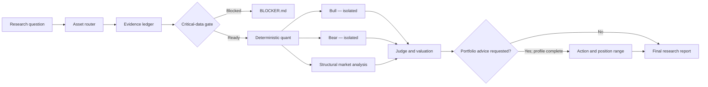

<div align="center">

# SAS‑FAS Analyst

### Evidence-first adversarial investment research for US equities and crypto assets

[](#)
[](#)
[](#)
[](LICENSE)

**Truth before thesis. Evidence before confidence. Survival before position size.**

</div>

---

SAS‑FAS is a long-horizon investment-research skill for AI agents. It converts public filings, protocol data, market structure and user-supplied evidence into an auditable research record, independent bull and bear theses, scenario valuation, and—only when requested and adequately informed—a portfolio decision.

Version 5 replaces the former six-skill handoff with one user-facing entry point and progressive disclosure. The orchestrator stays compact; equity, crypto, valuation, market-structure and portfolio rules load only when relevant.

## Design principles

- **Evidence ledger** — every material claim is traceable to a source, date and confidence level.
- **Adversarial independence** — Bull and Bear receive the same validated evidence, not each other's conclusions.
- **Asset-aware routing** — banks are not analyzed like manufacturers; tokens are not analyzed like companies.
- **Deterministic calculation** — defined financial and token metrics run in Python rather than model arithmetic.
- **Critical-data stop** — missing evidence that could change the verdict produces a blocker report, not invented certainty.
- **Long-horizon discipline** — 3–5 years is primary; 1–2 years is secondary. Short-term chart prediction is out of scope.
- **Aggressive ideas, survivable sizing** — asymmetric opportunities are welcome; concentration must reflect permanent-loss risk.

## System architecture



The runtime writes an immutable research dossier instead of repeatedly rewriting one large prompt state:

```text
00_manifest.json
01_evidence.json
02_quant.json
03_bull.md
04_bear.md
05_market_structure.md
06_judge.json
06_judge.md
07_FINAL_REPORT.md
```

## Coverage

| Domain | Routes and core questions |
|---|---|
| US equities | General operating companies, SaaS, banks, insurers, REITs, cyclicals, pre-revenue biotech and public crypto companies |
| Crypto | L1/L2, DeFi, DeAI/DePIN, stablecoins, meme assets and hybrid issuer/token structures |
| Valuation | Reverse DCF, normalized owner earnings, P/TBV and residual economics, probability-adjusted pipeline value, token-specific value capture and scenario ranges |
| Forensics | Cash conversion, Beneish screening, dilution, governance, insider or treasury flows, emissions, unlocks, admin keys, security and liquidity structure |
| Portfolio decision | Evidence grade, thesis state, odds state, staged sizing, extreme-undervaluation gates and explicit shorting constraints |

SAS‑FAS labels reasoning explicitly:

```text
[F] verified fact
[I] inference from identified facts
[H] falsifiable hypothesis
[U] decision-relevant unknown
```

## Installation

Recommended model: **GPT‑5.6**. Python 3 is required for deterministic calculations. Current public-source research requires network access.

Copy the single skill directory into your Codex skills folder.

**Windows PowerShell**

```powershell
Copy-Item -Recurse -Force .\skills\sas-fas-analyst "$env:USERPROFILE\.codex\skills\"
```

**macOS / Linux**

```bash
cp -R skills/sas-fas-analyst ~/.codex/skills/
```

Then invoke it directly or in natural language:

```text
Use $sas-fas-analyst to analyze TAO as a 3–5 year investment.

用 SAS 深度分析 PLTR：基本盘、估值、永久损失路径，以及当前价格是否值得建立仓位。
```

One invocation runs the complete workflow. Users no longer call separate ingest, bull, bear, crypto or judge skills.

## Research and decision behavior

SAS‑FAS may conclude that:

- the company is excellent but the odds are unfavorable;
- the protocol is improving while token capture remains weak;
- the bear case lacks evidence;
- the bull case has no defensible moat;
- available evidence is insufficient to decide.

Personalized buy, sell, short or position-sizing advice is withheld until the investor profile includes current exposure, cost basis, correlated holdings, liquidity needs, loss tolerance, leverage and relevant constraints. Without that profile, the system provides asset-level research only.

Default total-portfolio bands range from a 0.5%–2% observation position to a 10%–15% exceptional-undervaluation allocation. The upper band requires strong evidence, a stable or strengthening fundamental base, conservative margin of safety, survival through the research horizon and explicit ability to withstand a zero.

## Repository structure

```text
skills/sas-fas-analyst/
├── SKILL.md
├── agents/
│   └── openai.yaml
├── references/
│   ├── evidence-policy.md
│   ├── equities.md
│   ├── crypto.md
│   ├── valuation.md
│   ├── market-structure.md
│   ├── portfolio-decision.md
│   ├── input-schema.md
│   └── report-schema.md
└── scripts/
    ├── init_run.py
    ├── calculate_metrics.py
    └── validate_run.py
```

Historical runs are stored outside the skill by default under `CODEX_HOME/sas-fas-data/runs`. Prior dossiers are never overwritten. Raw private portfolio data is not retained unless the user explicitly requests it.

Run the regression suite before modifying the schemas, formulas or validation gates:

```bash
python -m unittest discover -s tests -v
```

## What SAS‑FAS is not

- Not an autonomous trading system.
- Not a source of guaranteed returns or price targets.
- Not a substitute for audited records, legal advice, tax advice or fiduciary judgment.
- Not immune to incomplete sources, model error, bad mappings or changing market conditions.

Every final report should be checked against its evidence ledger and primary sources before capital is committed.

## License

[MIT](LICENSE)

---

<div align="center">

**Structured Adversarial Synthesis · Financial Analysis System**

</div>
